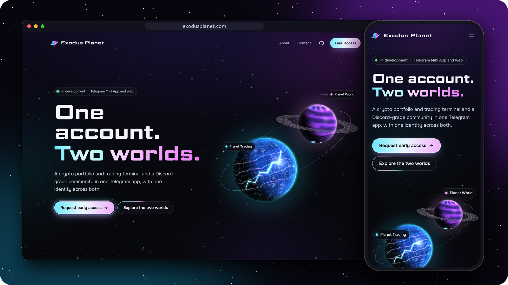
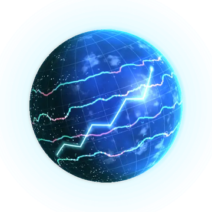
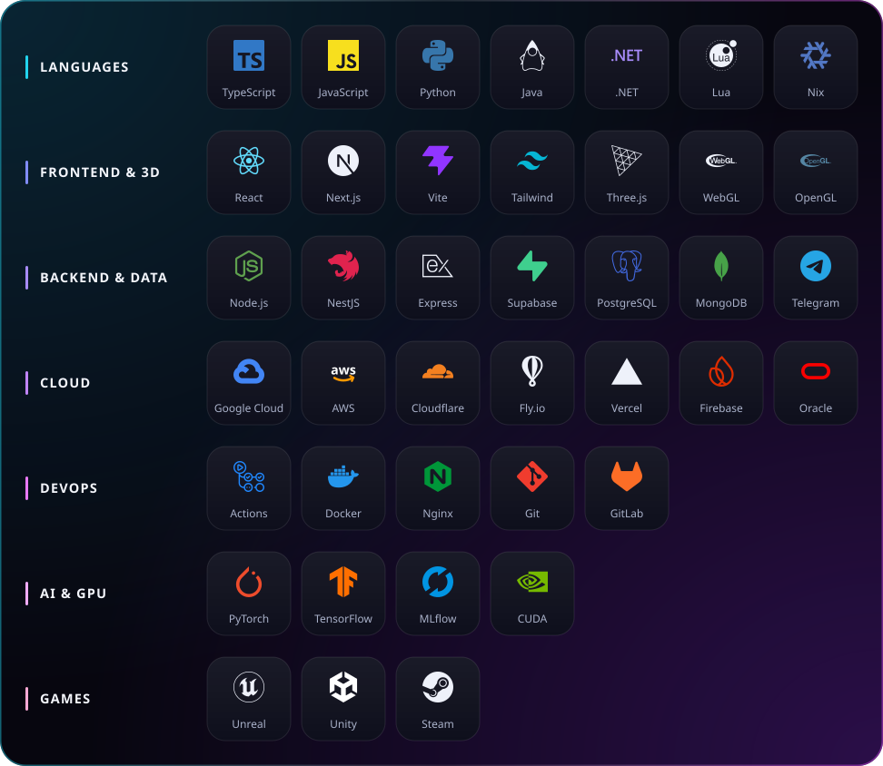

  

  &nbsp;
  &nbsp;
  

 

## About me
- Im Tigran, 18 years old nice guy.
 I'm a software engineer and founder from Yerevan, Armenia. I build products end to end: the product spec, the architecture, the cloud underneath and the interface people actually touch.
- Currently official partner at : **[AWS](https://aws.amazon.com/)** | **[Microsoft Azure](https://azure.microsoft.com/en-us)** | **[Discord](https://discord.com/)** 

- **Founder & CEO of [Exodus Planet](https://exodusplanet.com)**, where I also lead development.
- **Youngest Google Cloud Expert Developer** in all of Western Asia.
- I work across **real-time web apps, cloud infrastructure, 3D graphics, AI/ML and games**, and I like the places where those meet.

## 🪐 Exodus Planet

  

  <b>One account. Two worlds.</b> 
  A crypto portfolio and trading terminal and a Discord-grade community in one Telegram app, with one identity across both.

I founded **Exodus Planet** and run it as **Founder & CEO**, writing its product specification and architecture and leading the engineering. It runs as a **Telegram Mini App** and on the web (in development, with sign-in, sessions and the 3D Launch Pad already live), and the two modes share one account, one in-app economy (Asteroids) and one membership paid with Telegram Stars.

<table>
  <tr>
    <td width="50%" valign="top">
      

      <h3 align="center">Planet Trading</h3>
      
<i>Mission control for your portfolio.</i>

      
A data-dense terminal for tracking and practising. On the way: portfolio value, allocation and profit and loss over time, live market data and charts, Paper Trading seasons with leaderboards, and a wallet in early access.

    </td>
    <td width="50%" valign="top">
      

      <h3 align="center">Planet World</h3>
      
<i>A community home with the depth of Discord.</i>

      
Servers, channels and voice for the people you follow markets with, built for Telegram from day one. On the way: planets with roles and permissions, threads and direct messages, voice rooms, events and watch parties.

    </td>
  </tr>
</table>

**How it's built:** a TypeScript monorepo with a React web app that runs inside Telegram and in any browser, live 3D scenes in Three.js, a Node.js worker and Telegram bot on Fly.io, and Postgres on Supabase with row-level security, Edge Functions and realtime messaging, served from Cloudflare's edge. Every movement of value runs on the server as one audited transaction on a double-entry ledger.

  <a href="https://exodusplanet.com"><b>Visit exodusplanet.com →</b></a>

## 🛠️ Tech stack

  

  Building from Yerevan, Armenia 🇦🇲 · <a href="https://exodusplanet.com">exodusplanet.com</a> · <a href="mailto:lotex@exodusplanet.com">lotex@exodusplanet.com</a>

